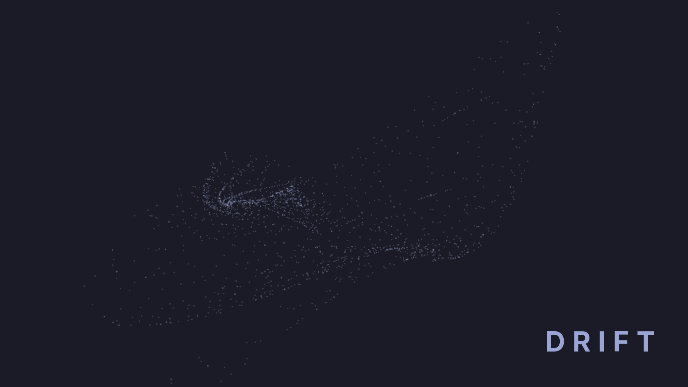

# Drift

A minimalist particle-animation screensaver for Omarchy — a cloud of round
dots that drifts and folds into shifting shapes, always drawn in your
**current Omarchy theme's own colours**.



> **Adapts to your theme, automatically.** Every dot is drawn in a single
> colour taken live from your active Omarchy theme (the same
> `Color.foreground` / `Color.background` the bar and lock screen use) — no
> settings to touch, no palette to pick. Switch theme, including an
> automatic day/night switch, and Drift follows immediately.
>
> **Minimalist by design.** One colour, round dots, one shape-generating
> formula per scene, nothing else — no accents, no gradients, no motion
> trails. It reads as calm ambient motion rather than a busy demo effect.

## What it does

Drift replaces your idle screensaver with a small cloud of dots — a couple
thousand tiny points, each positioned every frame by a closed-form
parametric formula `(i, t) → (x, y)` — that folds itself into an organic,
paper-thin shape and keeps drifting as long as the screensaver is shown.
Three scenes are built in — **RAY**, **BIRD**, **WING** — and it rotates
through them one at a time: each time your screen goes idle it opens on
the next scene in the rotation and stays on that single scene, however
long the screensaver ends up staying up, right until you dismiss it
(unlock, or any real input). The *next* time it activates, it moves one
step further through the rotation, cycling through all three before
repeating.

## Install

```sh
omarchy plugin add https://github.com/riccardolanza05/omarchy-ray-screensaver --enable
omarchy restart shell
```

That's the whole install — no dependencies to fetch and no build step.
Drift is pure QML/JavaScript running inside `omarchy-shell` (Quickshell +
Qt6, which every Omarchy install already has); it adds nothing to your
system beyond the plugin's own files under
`~/.config/omarchy/plugins/<id>/`. The restart is needed: the shell loads
the new service before it fully lets go of the stock one, so a couple of
things (like the IPC calls under "Try it" below) only answer correctly
after that restart.

Drift **clones Omarchy's stock idle service** (`omarchy.idle`) instead of
running alongside it — the same pattern the
[Lock Screen Explorer](https://github.com/sirjul1337/lock-explorer) plugin
uses for `omarchy.lock`. It reproduces the stock idle → screensaver → lock
timeline exactly (same timeouts, same stay-awake behaviour); the only
difference is *what's drawn* at the screensaver stage. The manifest's
`clonedFrom: omarchy.idle` is what tells `omarchy plugin add --enable` to
swap the two automatically — **you end up with the stock `omarchy.idle`
service disabled and Drift enabled in its place**, not both running at
once (which would double-fire every idle event). Nothing else on your
system is touched, and it's reversible any time — see "Uninstall" below.

### Uninstall / going back to the stock screensaver

```sh
omarchy plugin remove io.github.riccardolanza05.omarchy-ray-screensaver
omarchy plugin enable omarchy.idle
```

The first command removes Drift and its files; the second turns the stock
idle/screensaver service back on. Both are ordinary, safe Omarchy plugin
operations — nothing outside `~/.config/omarchy/plugins/` and your
`shell.json` plugin list is touched either way.

## Try it without waiting for idle

```sh
omarchy-shell ray-screensaver preview   # show it now, advancing the rotation
omarchy-shell ray-screensaver status    # what it's doing right now (JSON)
omarchy-shell ray-screensaver disable   # hide it / pause idle handling
omarchy-shell ray-screensaver enable    # resume
```

Jump straight to one of the three scenes by index (0=RAY, 1=BIRD, 2=WING)
without disturbing the rotation's own position:

```sh
omarchy-shell ray-screensaver previewIndex 1   # BIRD, say
```

## How it works

- **Rendering**: each monitor gets its own fullscreen `PanelWindow`
  (Wayland layer-shell, `WlrLayer.Overlay`) holding a `Canvas` that repaints
  every frame. Points are grouped into two brightness passes per frame and,
  within each pass, only the roughly 1-in-29 "big" dots get an actual round
  (octagon) shape; the other ~97% are drawn with a plain `fillRect()` —
  square vs. round is not visually distinguishable at the ~1px size those
  render at, and skipping path construction for the vast majority of points
  is what keeps ~1700 points at a steady ~60fps.
- **Colour**: read once per frame from the `qs.Commons` `Color` singleton
  that the rest of the Omarchy shell already uses, so a day/night theme
  switch is picked up live, mid-session.
- **Dismissal**: real input only. A grace period ignores everything for the
  first 2.5s after a scene opens (so the surface mapping under your cursor
  doesn't immediately dismiss it), and after that, mouse movement needs to
  clear a 3px threshold — not just "the mouse reported a position", which
  Wayland does once on its own the moment the surface gains hover — before
  it counts as a dismiss. A click or keypress dismisses immediately once
  past the grace period.
- **Idle timing**: unchanged from stock `omarchy.idle` — configured the
  same way, in `shell.json`'s `idle.screensaver` / `idle.lock` (seconds).

## Where the scenes come from

**RAY, BIRD, WING** are a 1:1 read of `setupHeroRay()` in
[plugins.omarchy.org](https://plugins.omarchy.org)'s own
`assets/js/app.js` — the hero animation on that site's homepage — verified
by fetching the file directly; it carries no comments, credit, or link to
a source of its own. It belongs to a genre of compact, trigonometry-driven
point-cloud sketches that circulates on X/Twitter under the hashtag
**#つぶやきProcessing** ("Tsubuyaki Processing" — sketches that fit in a
single tweet), most visibly through creators like
[@yuruyurau](https://x.com/yuruyurau). Drift credits that lineage but is
not a copy of any single named sketch — like the site's own version, it's
an independent implementation of the same style of formula. Three of the
site's six original scenes (ORIGINAL, COCOON, STORM) are intentionally
left out.

Two more scenes (WAVE, a rippled dot grid, and SPIRAL, a phyllotaxis
pattern) briefly lived here too and were removed to keep the plugin to
the original three — see this repo's commit history ("Add two
experimental scenes: WAVE and SPIRAL") to restore them, or the
[boids/flocking idea tracked as an issue](https://github.com/riccardolanza05/omarchy-ray-screensaver/issues)
for a possible future scene in a different style entirely.

## Requirements & dependencies

None beyond Omarchy itself. Drift is plain QML and JavaScript; it uses only
`Quickshell`, `Quickshell.Io`, `Quickshell.Wayland` and the shell's own
`qs.Commons` module, all of which ship with every Omarchy install. No
packages to install, no external services, no network access.

## Known limitations

- The rotation position only persists for as long as `omarchy-shell` keeps
  running (`keepLoaded: true` keeps it alive between idle cycles, but a
  full shell restart resets it) — it does not survive a logout/login.
- No per-user tuning knobs yet (point count, zoom, which scenes are in the
  rotation) — everything is fixed at the values that looked right during
  development. Contributions welcome.

## Development

Drift was built in a pair-programming session with
[Claude Code](https://claude.com/claude-code) (Anthropic's CLI coding
agent) — from the initial port of the site's formula through every fix and
feature in this repo's commit history. Every change was verified live on
the author's own Omarchy machine (screenshots, frame-rate measurements,
and a real idle-cycle test) before being committed.

## License

MIT — see [LICENSE](./LICENSE). `Service.qml` is based on the built-in
`omarchy.idle` service from [Omarchy](https://github.com/omacom/omarchy)
(MIT).
